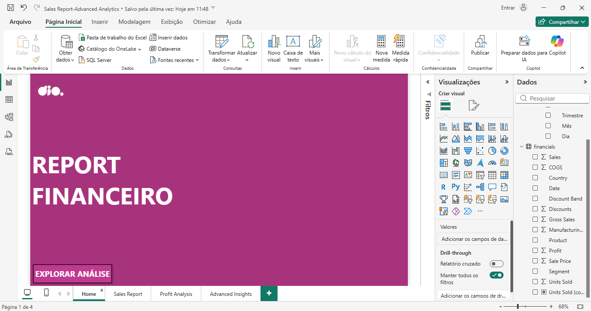
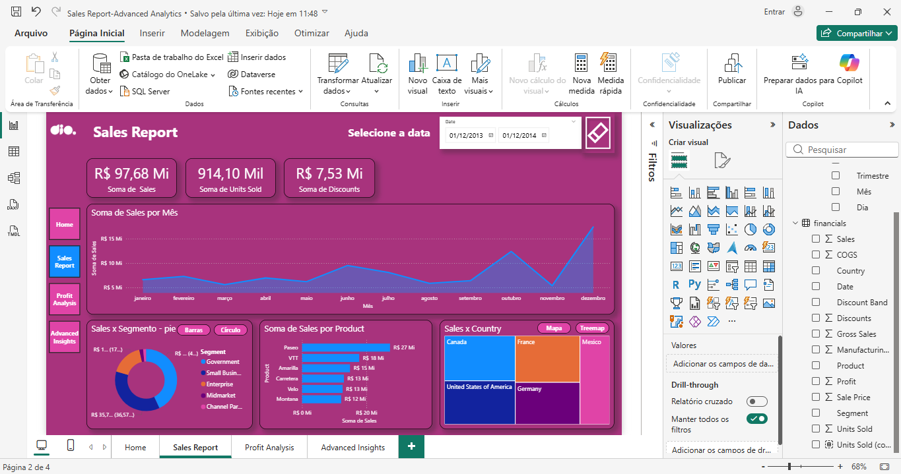
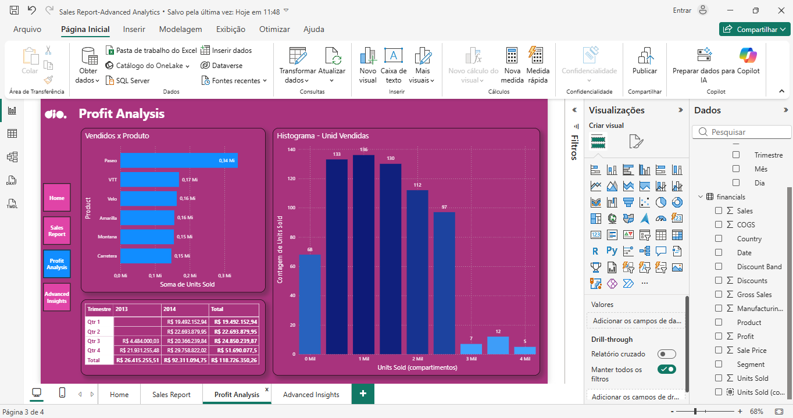
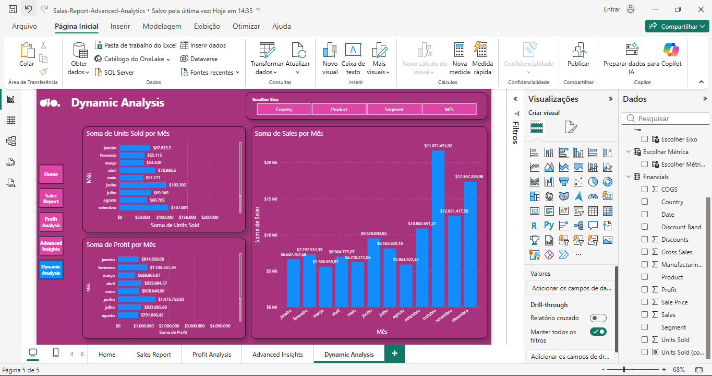

# 📊 Desafio de Projeto: Power BI Advanced Financial Analysis (UX/UI & Dynamic Analysis)

Este repositório contém o projeto de **Análise Financeira Avançada**, focado em performance, usabilidade e flexibilidade de dados. O dashboard foi desenvolvido utilizando recursos nativos e técnicas de contorno para limitações técnicas, garantindo uma navegação fluida e insights precisos.

---

## 🏛️ Contexto e Parcerias

* **Plataforma de Ensino**: [DIO (Digital Innovation One)](https://www.dio.me/)
* **Empresa Patrocinadora**: [Klabin](https://www.klabin.com.br/)
* **Formação**: Power BI Analyst
* **Desenvolvedor**: [Fred Cavalheiro]

---

## 🛠️ Tecnologias Utilizadas

* **[Microsoft Power BI Desktop](https://powerbi.microsoft.com/)**: Centralização do desenvolvimento (ETL, DAX e Data Viz).
* **Parâmetros de Campo (Field Parameters)**: Implementação de eixos dinâmicos, permitindo ao usuário alternar a visão do gráfico entre País, Produto, Segmento e Mês com um único clique.
* **Design Nativo e Transparente**: Uso estratégico de bordas e transparências para um layout moderno, superando limitações de hardware sem comprometer a estética.
* **Filtragem Avançada (Top N)**: Lógica de **N Superior** para identificação automática dos líderes de mercado.

---

## ⚠️ Justificativa Técnica e Adaptações de Engenharia

Este projeto é uma prova de **resiliência técnica** e capacidade de resolução de problemas em ambiente de desenvolvimento:

* **Contorno de Limitação de Metadados**: Durante a implementação do "Parâmetro de Campos" para métricas (Eixo Y), o motor DAX apresentou um conflito de tipos, tratando valores numéricos como texto. Como solução de alta performance, optei por uma **Análise Comparativa Simultânea**, exibindo as 3 métricas principais lado a lado. Isso eliminou o erro técnico e enriqueceu a UX, permitindo comparação direta de KPIs sem cliques adicionais.
* **Otimização de Hardware**: Priorizei um design limpo e elementos nativos para garantir a estabilidade do software em uma máquina de recursos limitados, evitando congelamentos e garantindo a fluidez da navegação.
* **Ajuste de Tipagem na Raiz**: Para eliminar imprecisões nos rótulos de dados (como arredondamentos indevidos), realizei a formatação de tipos diretamente na camada de modelagem, garantindo que "Units Sold" fosse tratado como número inteiro e "Sales/Profit" como moeda ($).

---

## 📂 Entregáveis do Projeto (Arquivos e Evidências)

* [📥 **Baixar Arquivo Power BI (.pbix)**](./Sales-Report-Advanced-Analytics.pbix)  
 > *Nota: Necessário Microsoft Power BI Desktop para visualização local.*

### 🖼️ Galeria de Telas
1. [**Ver Capa (Home)**](./01_Home_Dashboard.png)
2. [**Ver Sales Report (Pág. 1)**](./02_Sales_Report.png)
3. [**Ver Profit Analysis (Pág. 2)**](./03_Profit_Analysis.png)
4. [**Ver Advanced Insights (Pág. 3)**](./04_Advanced_Insights.png)
5. [**Ver Dynamic Analysis (Pág. 4)**](./05_Dynamic_Analysis.png)

---

## 🚀 Estrutura do Relatório

1. **Home**: Interface de entrada com navegação simplificada.
2. **Sales Report**: Visão geral de vendas por segmento e produtos.
3. **Profit Analysis**: Análise de lucratividade com matriz detalhada.
4. **Advanced Insights**: Identificação de outliers e Top 3 Produtos.
5. **Dynamic Analysis (Nova)**: Página interativa com eixos dinâmicos para análise multiplataforma de Vendas, Lucro e Unidades.

---

## ⚙️ Visualização das Páginas

1. **Página Capa (Home):** 

2. **Página 01 - Sales Report:** 

3. **Página 02 - Profit Analysis:** 

4. **Página 03 - Advanced Insights:** 

5. **Página 04 - Dynamic Analysis:** 

---

## 📞 Contato e Conexão
**Fred Cavalheiro**
* 🔄 **Transição de Carreira:** De Segurança Patrimonial (Vigilante) para Tecnologia/Dados.
* 🎓 **Técnico em Desenvolvimento de Sistemas** (Senac).
* 📚 **Estudante de:** Machine Learning e Análise de Dados (Python, Neo4j, Power BI e Excel).
* 🔗 **[Meu Perfil no LinkedIn](https://www.linkedin.com/in/fred-cavalheiro/)**

---
**Projeto desenvolvido para demonstrar superação de barreiras técnicas e competência em entrega de resultados analíticos com Power BI.**
